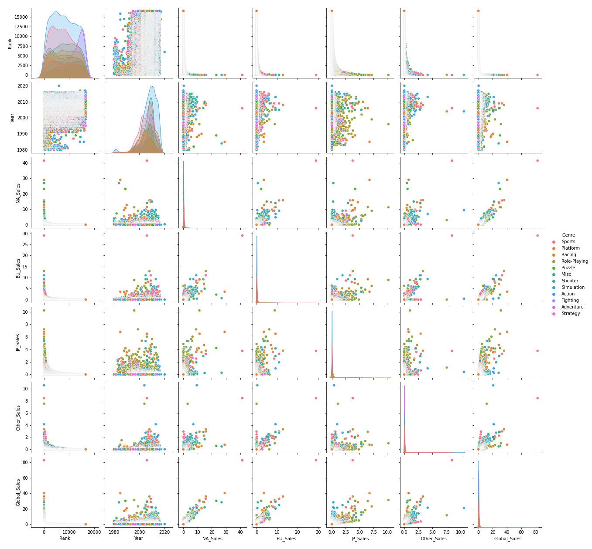

# video-game-sales-analysis
Analyzing sales from popular video games  using python
 
Download the Dataset here on  [Kaggle](https://www.kaggle.com/datasets/gregorut/videogamesales)

## Distributions of Genre

## Analysis Based on Genre
Here is a distribution showing how the data spreads based on its genre using a scatter plot and a histogram.

## Distributions of Platforms

There were 31 different platforms covered in this analysis
